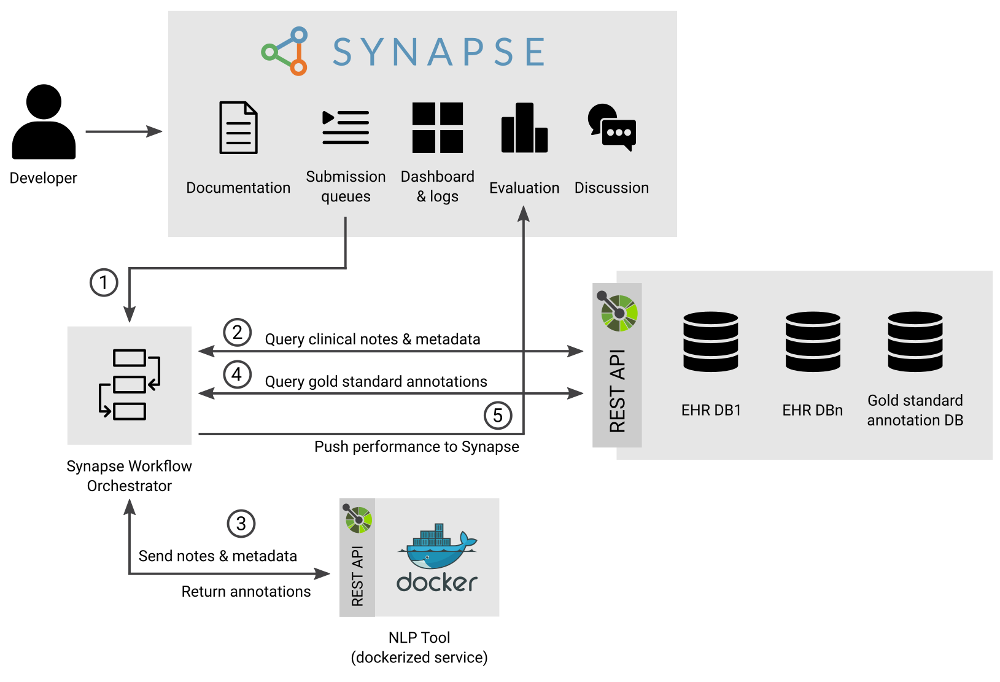

# NLP Sandbox Controller

[](https://github.com/nlpsandbox/nlpsandbox-controller/releases)
[](https://github.com/nlpsandbox/nlpsandbox-controller/blob/main/LICENSE)
[](https://discord.gg/Zb4ymtF "Realtime support / chat with the community and the team")

## Introduction

This document describes how to deploy the infrastructure needed to evaluate the
performance of an NLP Tool submitted to the NLP Sandbox.

One of the feature of the NLP Sandbox is the ability for NLP developers to
submit their NLP Tool once and then have it evaluated on multiple Data Hosting
Sites.

## Submission workflow

The figure below represents how the infrastructure deployed on a Data Hosting
Site evaluates the performance of a tool submitted by a developer to the NLP
Sandbox.



The submission workflow is composed of these steps:

1.  An NLP Developer submits an NLP tool for evaluation using the NLP Sandbox
    web client or command line interface (CLI). The submission is added to one of
    the submission queues of the NLP Sandbox depending on the NLP Task selected
    by the NLP Developer.
1.  The *Synapse Workflow Orchestrator* query one or more submissions queues
    for submissions to process. The Orchestrator that runs on a Data Hosting Site
    only query submissions that it can evaluate based on the type of data stored
    in the Data Node(s) available (XXX: clarify the case where there are multiple
    Data Nodes).
1.  If there is a `RECEIVED` submission, the Orchestrator will start running a
    workflow with the submission as its input.  The steps to the workflow is outlined
    in [workflow.cwl](workflow.cwl).
    1.  Starts the NLP Tool (web service) to evaluate
    1.  Queries N clinical notes from the Data Node.
    1.  Sends the N clinical notes to the NLP Tool and receives the
        predictions.
    1.  Repeats Steps 4 and 5 until all the clinical notes included
        in a given dataset have been processed by the NLP Tool.
    1.  Stops the NLP Tool.
    1.  Queries the gold standard from the Data Node.
    1.  Evaluates the performance of the predictions by comparing
        them to the gold standard.
    1.  Sends the performance measured to the NLP Sandbox backend server.
1. The NLP Developer and the community review the performance of the NLP Tool.

## Deploy the infrastructure on Data Hosting Site

To be a NLP sandbox data hosting site, the site must be able to host 4 main technology stacks via Docker. Here are the requirements: 

- Docker: ver 19.03.0+ or higher
- `docker-compose`: ver 1.25.5 or higher (`docker compose` is a built in function only for environments that have Docker desktop: mac, windows for Docker 20.10.6+)
- Data Node
- Synapse Workflow Orchestrator
- ELK (Elasticsearch, Logstash, Kibana)
- NLP Tools (E.g. Date-Annotators)

> Ideally for performance, the Data Node, Synapse Workflow Orchestrator and ELK are hosted on different servers (e.g. ec2 instances), but these can technically be deployed on one server/machine.

### Data Node

*We recommend this service to be run on a machine that at least has 2 CPU, 8GB ram and 300GB hard drive space*

1. Clone and start the data node.  This step should already be done by the cloudformation script for Sage Bionetworks.
    ```bash
    git clone https://github.com/nlpsandbox/data-node.git
    cd data-node
    cp .env.example .env
    docker-compose up -d
    ```
1. Push example data into the data node.  The scripts found in the `scripts` directory repository is for Sage Bionetworks only.  Please use this [script](https://github.com/nlpsandbox/nlpsandbox-client/blob/develop/examples/push_dataset.py) to push an example dataset.
    ```bash
    # set up conda or pipenv environment
    pip install nlpsandbox-client
    git clone https://github.com/nlpsandbox/nlpsandbox-client.git
    # cd to the ~/nlpsandbox-client directory
    # change the line `host = "http://localhost:8080/api/v1"` to point to your host http://yourhost.com:8080/api/v1
    vi examples/push_dataset.py
    # Downloads and pushes challenge data
    python examples/push_dataset.py
    ```
1. Following the example above, prepare your site's dataset and push data.
1. Inform Sage Bionetworks of data node endpoint ip so the queue configuration synapse table can be modified.
1. When loading data into the data node. The `dataset_id` should be made up of {dataset_name}-{dataset_version}.  We recommend the dataset_version to be the date that it was created.  An example of this would be `sagedataset-20201125`.  The `fhir_store_id` must be `evaluation` and the `annotation_store_id` must be `goldstandard`
1.  We understand each site will have its own security/networking protocols, but we wanted to make sure that regardless of where/how you decide to host the data node service, this command MUST work as it is a vital part of the submission infrastructure.
    ```
    docker run nlpsandbox/cli:4.1.1 datanode list-datasets --data_node_host <your.datanode.ip>/api/v1
    ```

### Synapse Workflow Orchestrator

*We recommend this service to be run on a machine that at least has 4 CPU, 16GB ram and 300GB hard drive space.* View [Submission workflow](#submission-workflow) for what this tool does.

1. Obtain/Create a Service Account (TBD)
1. Create internal Docker submission network
    ```
    docker network create --internal submission
    ```
1. Clone the repository
    ```bash
    git clone https://github.com/Sage-Bionetworks/SynapseWorkflowOrchestrator.git
    cd SynapseWorkflowOrchestrator
    ```
1. Copy the example template `cp .envTemplate .env` and configure. Sage Bionetworks uses the service account `nlp-sandbox-bot` and these `EVALUTION_TEMPLATES`, but these will be different per data hosting site.
    ```text
    SYNAPSE_USERNAME=nlp-sandbox-bot  # The data hosting site will have to created their own synapse service account.
    SYNAPSE_PASSWORD=
    EVALUATION_TEMPLATES={"queueid": "syn25585023"}  # The queueid will be provided to the site by Sage Bionetworks.  syn25585023 is the internal workflow synapse id.
    WORKFLOW_OUTPUT_ROOT_ENTITY_ID=synid  # This value will be provided to the site by Sage Bionetworks.
    # WES_ENDPOINT=http://localhost:8082/ga4gh/wes/v1  # This needs to be commented
    ```
1. Start the orchestrator
    ```bash
    docker-compose up -d
    ```
1. _Optional_: Start [portainerer](https://documentation.portainer.io/v2.0/deploy/ceinstalldocker/)  This is an open source tool for managing container-based software applications (e.g. provides a GUI to view Docker images and running containers).
    ```bash
    docker volume create portainer_data
    docker run -d -p 8000:8000 -p 9000:9000 --name=portainer --restart=always -v /var/run/docker.sock:/var/run/docker.sock -v portainer_data:/data portainer/portainer-ce
    ```
1. _If hosting ELK on a different instance from running submissions_:  Add the following section to the `docker-compose.yaml`.  The `ROUTE_URIS` will be different from the `Sage Bionetworks` site.  *We recommend the ELK service to be run on a machine that at least has 4 CPU, 16GB ram and 300GB hard drive space.*
    ```yaml
    logspout:
      image: bekt/logspout-logstash
      restart: on-failure
      environment:
        - ROUTE_URIS=logstash://10.23.60.253:5000  # Only for Sage Bionetworks
        - LOGSTASH_TAGS=docker-elk
      volumes:
        - /var/run/docker.sock:/var/run/docker.sock
    ```
    Where `10.23.60.253` is the IP Address of your external ELK Server
1. The orchestrator will only work if the data-node is configured correctly.

### Capturing Docker Logs

A solution to track Docker container logs are a **requirement** to be a data hosting site.  The reason for this is because the tool services submitted by participants are hosted as Docker containers and if there are issues with the service, the logs will have to be returned to participants.  We suggest using ELK stack (instructions below), but there are plenty of other methods you can use to [capture Docker logs](https://docs.docker.com/config/containers/logging/configure/).

1. Clone the repository
    ```bash
    git clone https://github.com/nlpsandbox/docker-elk.git
    cd docker-elk
    ```
1. Change the `elastic passwords` in each of these locations:
    - `docker-compose.yml`
    - `kibana/config/kibana.yml`
    - `logstash/config/logstash.yml`
    - `logstash/pipeline/logstash.conf`
1. - _Running ELK on its own machine_:
        ```
        docker-compose -f docker-compose.yml -f extensions/logspout/logspout-compose.yml up -d --build
        ```
        You will have to add logspout to the `SynapseWorkflowOrchestrator` if running the services on different machines.
    - _Running all the services on one machine_:
        - Make sure to update the `kibana` port in the `docker-compose.yml` or else there is a chance that you will run into `port already allocated` error.
            ```yaml
            ports:
                - "80:5601"  # Change 80 to an open port
            ```
1. Only use the free version of ELK. This can be configured [here](https://www.elastic.co/guide/en/kibana/7.11/managing-licenses.html)
1. Creating searchable index.  Click **hamburger menu** on left side, **Stack Management**, under Kibana, click **Index Pattern**, and **Create Index Pattern**.  If set up correct you should be able to input `logstash-*` as your index pattern and click "I don't want to use the time filter".
1. View docker logs.  Click **hamburger menu** on left side, click **Discover**.  You should see docker logs now.

### Example Date Annotator

1. Clone and start the date annotator. This step should already be done by the cloudformation script for Sage Bionetworks.
    ```bash
    git clone https://github.com/nlpsandbox/date-annotator-example.git
    cd date-annotator-example
    ```
    _If running all services on one machine:_ must make sure `port` is changed to avoid `port already allocated` error.
    ```yaml
    ports:
      - "80:80"  # Change the first 80 to an open port
    ```
    Start the service
    ```bash
    docker-compose up -d
    ```

## Annotating Notes Manually

1. Get example notes:

    ```
    nlp-cli datanode list-notes --data_node_host http://0.0.0.0/api/v1 --dataset_id 2014-i2b2-20201203-subset --fhir_store_id evaluation --output example_notes.json
    ```

1. Annotate notes:

    ```
    nlp-cli tool annotate-note --annotator_host http://0.0.0.0:8080/api/v1 --note_json example_notes.json --tool_type nlpsandbox:date-annotator
    ```


## Scoring Submissions Manually

The scoring is done as part of the workflow, but here are the steps to score submissions manually.

1. Determine which submission that you want to score manually (e.g 111111)
1. Install `nlpsandbox-client`
    ```
    pip install nlpsandbox-client
    ```
1. Download goldstandard
    ```
    nlp-cli datanode list-annotations --data_node_host http://0.0.0.0/api/v1 --dataset_id 2014-i2b2-20201203 --annotation_store_id goldstandard --output goldstandard.json
    ```
1. Download submission
    ```
    nlp-cli datanode list-annotations --data_node_host http://0.0.0.0/api/v1 --dataset_id 2014-i2b2-20201203 --annotation_store_id submission-111111 --output sub.json
    ```
1. Evaluate submission
    ```
    nlp-cli evaluate-prediction --pred_filepath sub.json --gold_filepath goldstandard.json --tool_type nlpsandbox:date-annotator
    ```

## SAGE BIONETWORKS ONLY

### AWS infrastructure
The infrastructure is created through cloudformation templates.  Important notes:

1. Must create a security group that has network access between the ELK, data node and infrastructure instances.  Only allow inbound access from the 3 different instances, but allow all outbound traffic access.


### Stopping Submissions that run over the expected quota
On top of the quota checking system that is built into `annotate_note.py`, there has to be some safeguard for making sure that submissions quota the time quota are stopped.  This is because the submission run time check happens within a for loop, it a docker run command happens to be stuck forever, the submission will never be deemed over the quota.  There is a `stop-submission-over-quota` function in `challengeutils`, unfortunately, this function requires a submission view as input and there is a high likelihood that each queue could have a different runtime.  Therefore, we will not be using this function.

```
python scripts/reject_submissions.py
```

### Orchestrator workflow

This repository will host the `CWL` workflow and tools required to set up the `model-to-data` challenge infrastructure for `NLP Sandbox`

For more information about the tools, please head to [ChallengeWorkflowTemplates](https://github.com/Sage-Bionetworks/ChallengeWorkflowTemplates)


### Requirements
* `pip3 install cwltool`
* A synapse account / configuration file.  Learn more [here](https://docs.synapse.org/articles/client_configuration.html#for-developers)
* A Synapse submission to a queue.  Learn more [here](https://docs.synapse.org/articles/evaluation_queues.html#submissions)

### What to edit

* **workflow.cwl**
    If there are updates to the api version or dataset version, the workflow inputs
    have to be editted
    ```yaml
    - id: dataset_name
        type: string
        default: "2014-i2b2"  # change this
    - id: dataset_version
        type: string
        default: "20201203" # change this
    - id: api_version
        type: string
        default: "1.0.1" # change this
    ```

### Testing the workflow locally

```bash
cwltool workflow.cwl --submissionId 12345 \
                      --adminUploadSynId syn12345 \
                      --submitterUploadSynId syn12345 \
                      --workflowSynapseId syn12345 \
                      --synaspeConfig ~/.synapseConfig
```
where:
* `submissionId` - ID of the Synapse submission to process
* `adminUploadSynId` - ID of a Synapse folder accessible only to the submission queue administrator
* `submitterUploadSynId` - ID of a Synapse folder accessible to the submitter
* `workflowSynapseId` - ID of the Synapse entity containing a reference to the workflow file(s)
* `synapseConfig` - filepath to your Synapse credentials

### Adding tools to benchmark

1. Create evaluation queues per new tool
1. Edit these files by adding the tool
    - validate_tool.py
    - determine_annotator_type.cwl
    - annotate_note.py
    - convert_annotations.cwl
    - convert_score.cwl
    - queue config internal synapse table

### Loading Sage Data Node

1. ssh into the data node
1. Start the data node (make sure its the latest version)
1. Install anaconda
1. Install nlpsandbox-client
1. Look for the latest dataset to load [here](https://www.synapse.org/#!Synapse:syn25815735)
1. Run `scripts/push_data.py`

    ```
    # All data
    python scripts/push_data.py syn25891742
    # Subsetted data - example
    python scripts/push_data.py syn25891740
    ```

### Opening and Closing the queues

For scheduled and unscheduled maintenance, the main queues should be closed so that participants won't be able to submit to them.  To do so, run this script:

```bash
# This will revoke submit permissions for the NLP sandbox users
python scripts/toggle_queue.py close
# This will give submit permissions for the NLP sandbox users
python scripts/toggle_queue.py open
```

### Add centers/datasets

When we add centers and their datasets, use this [code](scripts/add_center.py). The steps are:

1. Create center Synapse service account?
1. Create internal queues
1. Add to configuration table
1. Make sure orchestrator configured to accept submissions from internal queues {"queue_id": "syn25582656"...}
1. Add to submission view
